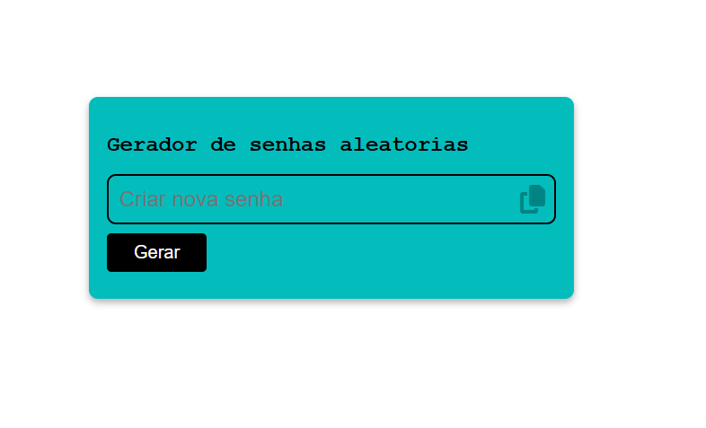

# 🔐 Gerador de Senhas Aleatórias

Um projeto simples e funcional de **geração de senhas seguras**, desenvolvido com **HTML, CSS e JavaScript**.

---

## 🚀 Funcionalidades

* 🔑 Geração de senhas aleatórias
* 📋 Copiar senha com um clique
* 💬 Feedback visual ao copiar senha
* 🎨 Interface simples e intuitiva

---

## 🛠️ Tecnologias utilizadas

* HTML5
* CSS3
* JavaScript
* Font Awesome (ícones)

---

## 📸 Preview

<p align="center">
  <a href="https://vieira-p004.github.io/gerador-senhas/" target="_blank">
    
  </a>
</p>

<p align="center">
  <a href="https://vieira-p004.github.io/gerador-senhas/">
    👉 Acesse o projeto online
  </a>
</p>

---

## 📂 Estrutura do projeto

```
📁 gerador-de-senhas
 ├── index.html
 ├── style.css
 └── script.js
```

---

## ▶️ Como executar

1. Clone o repositório:

```bash
git clone https://github.com/vieira-p004/gerador-senhas.git
```

2. Acesse a pasta do projeto:

```bash
cd gerador-senhas
```

3. Abra o arquivo `index.html` no navegador

---

## 🧠 Lógica do projeto

A senha é gerada a partir de:

* Letras maiúsculas e minúsculas
* Números
* Caracteres especiais

Utilizando:

* `Math.random()` para aleatoriedade
* Manipulação de strings
* Eventos (`click`) para interação

---
